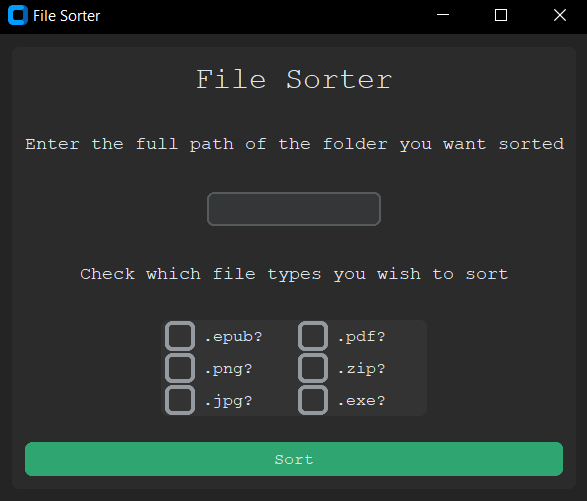

# About

A program that sorts files based on the file extension.

# Table of Contents

- [Local Setup](#local-setup)
- [Usage](#usage)
- [Technologies](#technologies)
- [License](#license)

## Local Setup

Download or clone the GitHub Project

Install the project requirements with this pip command:

`pip install -r requirments txt`

Run the file sorter with the following command:

`python file-sorter-gui.py`

Alternatively, download the exe and run that

## Usage

After running the program. Input the path to the folder you wish to sort
Select the types of files you want sorted. Click sort.

Warning: This program will move the files inside the target folder and create new folders so be careful where you use it. 

## Technologies

- Python
- CustomTkinter

## Status

Completed. 

In the future I would like to add an undo option to unsort files in case the wrong folder is sorted.

## License

MIT License

